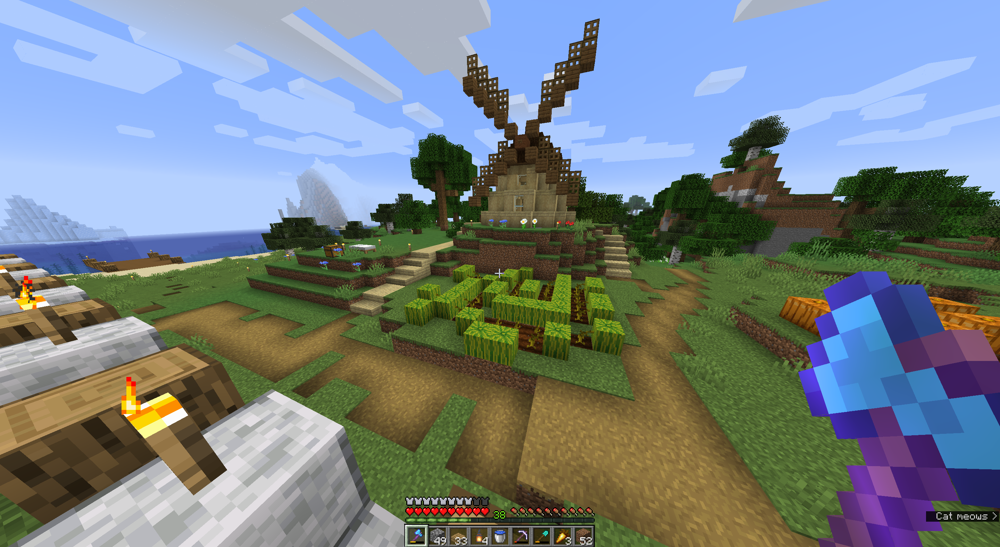

# Getting Started with Minecraft Survival

> Experimenting with GitHub pages -- not intended to be an actual and complete Minecraft getting started guide.

## Create Your First World
> Where to get Minecraft and how to create a world

## Survive!
### [Survive the First Night](Tutorials/early-survival/first-night.md)
> What are the first things you should do to survive in Minecraft?
TBD

## Long-Term Survival
> You can survive the night. What should you do next? 
TBD

### Resources
* [Minecraft guide: How to survive your first night in Minecraft
](https://www.windowscentral.com/how-survive-your-first-night-minecraft)

## Get Food
> Where to get food
TBD

## Get Tools
TBD

## Mine
> How to get started with serious mining.
TBD

## Farm
TBD

Markdown (Folder) - with leading slash and correct filename -- THIS WORKS IN GITHUB BUT NOT GITHUB PAGES

Link to github file in repo (markdown syntax) - THIS NOW WORKS, BUT IT'S A LINK
["Barn"](https://github.com/galejwnaylor/Minecraft/blob/main/images/barn.png)

## Build
TBD

<!--- CAN'T GET THE IMAGES in folders TO WORK! -->
HTML (Full Path)

HTML (Root)

Markdown (Root)

## Exploring

TBD

# Advanced Concepts

- [Water Elevators](Concepts/water-elevators.md)

